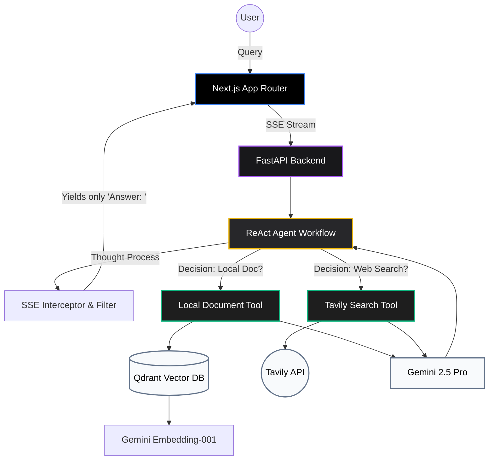

# 🚀 Enterprise RAG Agent Workflow


An advanced, production-ready Enterprise Retrieval-Augmented Generation (RAG) system powered by **Google Gemini 2.5 Pro**, **LlamaIndex**, and **Next.js**. This architecture introduces an autonomous `ReActAgent` capable of intelligent routing between local corporate knowledge bases and real-time internet research.

## ✨ Core Features

- 🧠 **Dual-Routing Agentic Workflow:** An advanced `ReActAgent` that intelligently routes queries between a local `Qdrant` vector database (for internal knowledge) and `Tavily` (for real-time web search).
- 🛡️ **Anti-Arrogance Prompting:** System-level prompt injection guarantees the LLM strictly prioritizes internal documents over its pre-trained parametric memory, overcoming "commonsense arrogance" (e.g., retrieving details about an unreleased internal product).
- 🔗 **Google Ecosystem Native:** Fully utilizes the Gemini API for both inference (`models/gemini-2.5-pro`) and dense vector embeddings (`models/gemini-embedding-001`), ensuring 768-dimensional consistency.
- ⚡ **Real-time SSE Streaming:** Provides a buttery-smooth typewriter effect by strictly filtering ReAct thought processes (`Thought:`, `Action:`) backend-side, delivering only the final parsed answer to the frontend.
- 🎨 **Premium UI/UX:** A stunning, responsive Next.js frontend built with TailwindCSS, featuring glassmorphism, dynamic auto-scrolling, distinct message bubbles, and full React-Markdown parsing.

---

## 🏗️ System Architecture



---

## 🚀 Quick Start Guide

### 1. Prerequisites
- Docker & Docker Compose
- Node.js 18+ (for frontend)
- Python 3.11+ (for local ingestion/debug)

### 2. Environment Configuration
Create a `.env` file in the root directory:
```env
GOOGLE_API_KEY=your_gemini_api_key_here
TAVILY_API_KEY=your_tavily_api_key_here
QDRANT_HOST=localhost
```

### 3. Start Backend & Database
Use Docker Compose to spin up the Qdrant Vector DB and the FastAPI backend:
```bash
docker-compose up -d
```
*(If running backend locally via Uvicorn for development: `uvicorn app.main:app --host 0.0.0.0 --port 8000`)*

### 4. Data Ingestion
Ingest internal documents into the Qdrant database using Gemini Embeddings:
```bash
python scripts/ingest_data.py
```

### 5. Start Frontend
Navigate to the `frontend` directory and start the Next.js app:
```bash
cd frontend
npm install
npm run dev
```

### 6. Experience the Agent
Open your browser and navigate to `http://localhost:3000`. Try asking:
- *"苹果最新的全息手机叫什么？卖多少钱？"* (Tests strict local document retrieval)
- *"今天吉隆坡的天气如何？"* (Tests Tavily web search fallback)

---
*Developed with Next.js, FastAPI, LlamaIndex, and ❤️*
