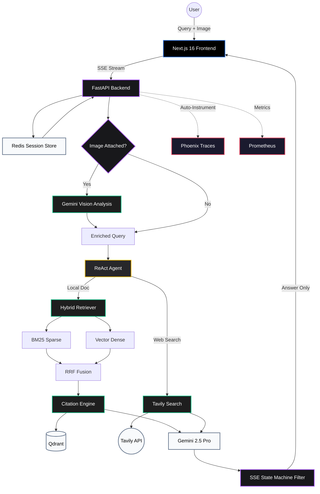

# 🚀 Enterprise RAG Agent v2.1


An advanced, production-ready Enterprise Retrieval-Augmented Generation (RAG) system powered by **Google Gemini 2.5 Pro**, **LlamaIndex**, and **Next.js**. Features an autonomous `ReActAgent` with multi-turn memory, multimodal image understanding, hybrid BM25+Vector retrieval, citation tracking, and full observability.

---

## ✨ Core Features

### 🧠 AI & LLM Capabilities
- **Multi-Turn Conversation Memory** — Session-based chat history with Redis persistence, enabling contextual follow-up questions
- **Multimodal RAG** — Upload images via drag-and-drop, clipboard paste, or file picker; Gemini Vision analyzes images and injects context into the RAG pipeline
- **Dual-Routing Agentic Workflow** — `ReActAgent` intelligently routes between local `Qdrant` knowledge base and `Tavily` web search
- **Anti-Arrogance Prompting** — System-level prompt injection ensures the LLM prioritizes internal documents over parametric memory

### 🔍 Advanced Retrieval
- **BM25 + Vector Hybrid Search** — Combines sparse keyword matching with dense embedding retrieval via `QueryFusionRetriever` using Reciprocal Rank Fusion (RRF)
- **Citation Query Engine** — Every answer includes traceable source documents with file names, relevance scores, and content previews
- **Singleton Index Caching** — `@lru_cache` eliminates per-request index rebuilds; read/write paths fully separated

### 🎨 Premium Frontend
- **Syntax-Highlighted Code Blocks** — `react-syntax-highlighter` with oneDark theme, language badges, and one-click copy
- **Rich Markdown Rendering** — GFM tables, inline code, links, lists with `@tailwindcss/typography`
- **Session Sidebar** — Create, switch, and delete conversations with real-time session management
- **Micro-Animations** — Fade-in-up message entrances, three-dot typing indicator, code block hover glow
- **Real-time SSE Streaming** — State-machine filtered streaming that cleanly separates ReAct reasoning from user-facing answers

### ⚙️ Engineering & Observability
- **Arize Phoenix Tracing** — Full LLM/Retriever/Tool call tracing with latency and token analytics at `localhost:6006`
- **Prometheus Metrics** — Request latency, throughput, and error rate monitoring via `/metrics` endpoint
- **Structured Logging** — Loguru with `InterceptHandler` for unified log routing
- **Redis Session Persistence** — Survives container restarts with automatic in-memory fallback

---

## 🏗️ System Architecture



---

## 📁 Project Structure

```
enterprise-rag-agent/
├── app/
│   ├── api/
│   │   └── chat.py              # Chat endpoint, SSE streaming, Vision integration
│   ├── core/
│   │   └── logger.py            # Loguru structured logging
│   ├── services/
│   │   ├── memory.py            # Redis + in-memory session store
│   │   └── vector_store.py      # Hybrid retrieval, citation engine, ingestion
│   └── main.py                  # FastAPI app, Phoenix + Prometheus init
├── frontend/
│   └── src/
│       ├── app/
│       │   ├── globals.css      # Design system, animations, code block styles
│       │   ├── layout.tsx       # Root layout with metadata
│       │   └── page.tsx         # Home page
│       └── components/chat/
│           ├── ChatContainer.tsx # Main chat orchestrator, session management
│           ├── ChatInput.tsx     # Text + image input with drag/drop/paste
│           ├── ChatMessage.tsx   # Markdown + syntax highlighting + citations
│           └── Sidebar.tsx      # Session list with CRUD operations
├── scripts/
│   └── ingest_data.py           # Document ingestion pipeline
├── data/                        # Source documents for RAG
├── docker-compose.yml           # Qdrant + Redis + Backend orchestration
├── Dockerfile                   # Backend container image
└── requirements.txt             # Python dependencies
```

---

## 🚀 Quick Start

### 1. Prerequisites
- Docker & Docker Compose
- Node.js 18+ (for frontend)
- Python 3.11+ (for local ingestion/debug)

### 2. Environment Configuration
Create a `.env` file in the root directory:
```env
GOOGLE_API_KEY=your_gemini_api_key_here
TAVILY_API_KEY=your_tavily_api_key_here
QDRANT_HOST=localhost
REDIS_URL=redis://localhost:6379/0
```

### 3. Start Infrastructure
```bash
docker compose up -d
```

This starts:
| Service | Port | Purpose |
|---------|------|---------|
| Qdrant | 6333 | Vector database |
| Redis | 6379 | Session persistence |
| Backend | 8000 | FastAPI API server |

### 4. Data Ingestion
```bash
python scripts/ingest_data.py
```

### 5. Start Frontend
```bash
cd frontend
npm install
npm run dev
```

### 6. Experience the Agent
Open `http://localhost:3000` and try:

| Query | Tests |
|-------|-------|
| *"What is the latest holographic phone from Apple? How much does it cost?"* | Local document retrieval + citation |
| *"What's the weather in Kuala Lumpur today?"* | Tavily web search fallback |
| *"What about its screen size?"* | Multi-turn memory (follow-up) |
| 📎 Upload an image + *"Analyze this image"* | Multimodal Vision analysis |

---

## 📊 Observability

| Tool | URL | Purpose |
|------|-----|---------|
| Phoenix Traces | `http://localhost:6006` | LLM call tracing, token costs, latency |
| Prometheus | `http://localhost:8000/metrics` | Request metrics, error rates |

---

## 🔧 Tech Stack

| Layer | Technology |
|-------|-----------|
| LLM | Google Gemini 2.5 Pro |
| Embeddings | Gemini Embedding-001 (768d) |
| Vision | Gemini 2.5 Pro (multimodal) |
| Framework | LlamaIndex (ReActAgent) |
| Vector DB | Qdrant |
| Cache | Redis 7 (Alpine) |
| Backend | FastAPI + Uvicorn |
| Frontend | Next.js 16 + React 19 |
| Styling | TailwindCSS 4 + Typography |
| Code Highlight | react-syntax-highlighter (Prism) |
| Web Search | Tavily API |
| Tracing | Arize Phoenix + OpenTelemetry |
| Metrics | Prometheus + FastAPI Instrumentator |
| Logging | Loguru |

---

## 📋 Changelog

### v2.1 — Optimization Phase
- ✅ Redis session persistence (cross-restart)
- ✅ Syntax-highlighted code blocks with copy button
- ✅ Micro-animation system (fade-in-up, typing indicator, hover effects)
- ✅ SSE state machine refactor for stream stability

### v2.0 — Architecture Upgrade
- ✅ Multi-turn conversation memory with session management
- ✅ Multimodal RAG (image upload + Gemini Vision)
- ✅ BM25 + Vector hybrid retrieval with RRF fusion
- ✅ Citation Query Engine with source panel
- ✅ Sidebar session management (create/switch/delete)
- ✅ GFM Markdown rendering
- ✅ Phoenix observability + Prometheus metrics
- ✅ Singleton index caching with `@lru_cache`

### v1.0 — Initial Release
- ✅ Basic ReActAgent with Gemini 2.5 Pro
- ✅ Qdrant vector search
- ✅ Tavily web search tool
- ✅ SSE streaming
- ✅ Next.js frontend

---

*Developed with Next.js, FastAPI, LlamaIndex, and ❤️*
