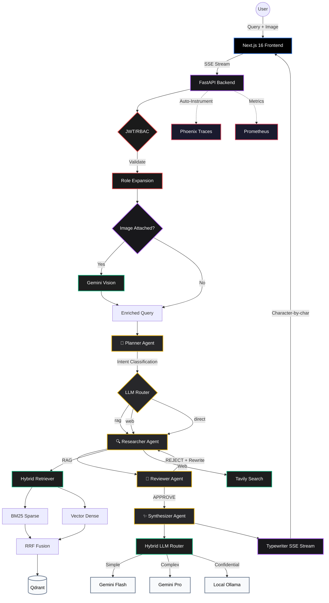

# 🚀 Enterprise RAG Agent v3.0


An enterprise-grade, production-ready AI Agent system powered by **Google Gemini 2.5 Pro**, **LangGraph**, and **Next.js**. Features a multi-agent pipeline with Corrective RAG (CRAG) self-reflection, hybrid LLM routing, JWT/RBAC security, multi-channel gateway, and full-stack observability.

---

## ✨ Core Features

### 🤖 Multi-Agent Orchestration (v3.0)
- **4-Node LangGraph Pipeline** — Planner → Researcher → Reviewer → Synthesizer with conditional routing
- **Corrective RAG (CRAG)** — Self-reflective quality grading with automatic query rewriting and retry loops (up to 3 attempts)
- **Intent-Driven Routing** — Planner agent classifies queries into `rag`, `web`, or `direct` intents for optimal resource utilization
- **Answer Synthesis** — Dedicated synthesizer agent polishes raw answers with proper formatting and artifact removal

### 🧠 Hybrid LLM Router
- **Data Sensitivity Routing** — Confidential documents automatically routed to local Ollama (DeepSeek R1) for air-gapped processing
- **Query Complexity Optimization** — Simple queries → Gemini Flash (fast/cheap), complex reasoning → Gemini Pro (best quality)
- **Automatic Fallback** — Ollama unavailable → graceful fallback to Gemini Flash

### 🔐 JWT/RBAC Security Layer
- **JWT Authentication** — HS256/RS256 token validation with configurable secret
- **Role-Based Access Control** — Hierarchical roles (`viewer` → `engineer` → `manager` → `executive`) with document-level filtering
- **Qdrant Access Tags** — RBAC tags injected into vector search filters for data isolation
- **Dev Mode Bypass** — `AUTH_ENABLED=false` for seamless local development

### 🌐 Multi-Channel Gateway
- **Unified Message Protocol** — Standardized `UnifiedMessage`/`UnifiedResponse` across all channels
- **Web Adapter** — SSE streaming for the Next.js frontend
- **API Adapter** — Synchronous JSON for CI/CD, CLIs, and microservices
- **Extensible Architecture** — Abstract `ChannelAdapter` base class for adding Slack, Feishu, WeChat bots

### 🔍 Advanced Retrieval
- **BM25 + Vector Hybrid Search** — Sparse keyword + dense embedding retrieval via `QueryFusionRetriever` with Reciprocal Rank Fusion (RRF)
- **Citation Query Engine** — Traceable source documents with file names, relevance scores, and content previews
- **Singleton Index Caching** — `@lru_cache` eliminates per-request index rebuilds

### 🧠 AI & LLM Capabilities
- **Multi-Turn Conversation Memory** — Redis-backed session history with contextual follow-up support
- **Multimodal RAG** — Image upload via drag-and-drop, clipboard paste, or file picker with Gemini Vision analysis
- **Anti-Arrogance Prompting** — System prompts ensure internal documents are prioritized over parametric memory

### 🎨 Premium Frontend
- **Typewriter Streaming** — Character-by-character SSE streaming with blinking cursor animation
- **Syntax-Highlighted Code Blocks** — `react-syntax-highlighter` with oneDark theme and one-click copy
- **Rich Markdown Rendering** — GFM tables, inline code, links, lists with `@tailwindcss/typography`
- **Session Sidebar** — Create, switch, and delete conversations with real-time management
- **Micro-Animations** — Fade-in-up entrances, three-dot typing indicator, hover effects

### ⚙️ Engineering & Observability
- **Arize Phoenix Tracing** — Full LLM/Retriever/Tool call tracing with latency and token analytics
- **Pipeline Performance Logging** — Per-node timing instrumentation with structured logs
- **Prometheus Metrics** — Request latency, throughput, and error rate via `/metrics`
- **Structured Logging** — Loguru with `InterceptHandler` for unified routing
- **66-Test Suite** — Comprehensive pytest coverage across agents, auth, router, channels, and pipeline

---

## 🏗️ System Architecture



---

## 📁 Project Structure

```
enterprise-rag-agent/
├── app/
│   ├── agents/                     # Multi-Agent LangGraph Pipeline
│   │   ├── graph.py                # LangGraph StateGraph builder (instrumented)
│   │   ├── state.py                # AgentState TypedDict (shared state)
│   │   ├── planner.py              # Intent classifier (rag/web/direct)
│   │   ├── researcher.py           # RAG retrieval + web search + direct answer
│   │   ├── reviewer.py             # CRAG quality grading + query rewriting
│   │   └── synthesizer.py          # Answer polishing + artifact removal
│   ├── api/
│   │   ├── chat.py                 # Chat endpoint, SSE streaming, Vision
│   │   └── channels.py             # Multi-channel gateway API routes
│   ├── channels/                   # Channel Adapters
│   │   ├── gateway.py              # Unified message protocol + dispatcher
│   │   ├── web_adapter.py          # Web/SSE adapter
│   │   └── api_adapter.py          # REST API adapter
│   ├── core/
│   │   ├── auth.py                 # JWT authentication + RBAC role expansion
│   │   ├── llm_router.py           # Hybrid LLM Router (Cloud/Local routing)
│   │   └── logger.py               # Loguru structured logging
│   ├── services/
│   │   ├── memory.py               # Redis + in-memory session store
│   │   ├── vector_store.py         # Hybrid retrieval, citation engine
│   │   └── document_processor.py   # Document ingestion pipeline
│   └── main.py                     # FastAPI app, Phoenix + Prometheus init
├── frontend/
│   └── src/
│       ├── app/
│       │   ├── globals.css         # Design system, animations, typewriter cursor
│       │   ├── layout.tsx          # Root layout with metadata
│       │   └── page.tsx            # Home page
│       └── components/chat/
│           ├── ChatContainer.tsx    # Main orchestrator, streaming state machine
│           ├── ChatInput.tsx        # Text + image input with drag/drop/paste
│           ├── ChatMessage.tsx      # Markdown rendering + typewriter cursor
│           └── Sidebar.tsx          # Session list with CRUD operations
├── tests/                          # Comprehensive Test Suite (66 tests)
│   ├── conftest.py                 # Shared fixtures (MockLLM, test states)
│   ├── test_agents.py              # Planner, Reviewer, Synthesizer unit tests
│   ├── test_auth.py                # JWT, RBAC, role hierarchy tests
│   ├── test_channels.py            # Gateway, adapter, protocol tests
│   ├── test_graph_pipeline.py      # E2E pipeline + routing tests
│   └── test_llm_router.py          # LLM routing logic tests
├── scripts/
│   ├── ingest_data.py              # Basic document ingestion
│   └── ingest_with_rbac.py         # RBAC-tagged document ingestion
├── data/                           # Source documents for RAG
├── docker-compose.yml              # Qdrant + Redis + Backend orchestration
├── Dockerfile                      # Backend container image
└── requirements.txt                # Python dependencies
```

---

## 🚀 Quick Start

### 1. Prerequisites
- Docker & Docker Compose
- Node.js 18+ (for frontend)
- Python 3.11+ (for local development)

### 2. Environment Configuration
Create a `.env` file in the root directory:
```env
GOOGLE_API_KEY=your_gemini_api_key_here
TAVILY_API_KEY=your_tavily_api_key_here
QDRANT_HOST=localhost
REDIS_URL=redis://localhost:6379/0

# Optional: Enable JWT auth (default: false for dev)
AUTH_ENABLED=false
JWT_SECRET=your-secret-key-here

# Optional: Enable Hybrid LLM Router
LLM_ROUTER_ENABLED=false
OLLAMA_BASE_URL=http://localhost:11434
OLLAMA_MODEL=deepseek-r1:14b
```

### 3. Start Infrastructure
```bash
docker compose up -d
```

This starts:
| Service | Port | Purpose |
|---------|------|---------|
| Qdrant | 6333 | Vector database |
| Redis | 6379 | Session persistence |
| Backend | 8000 | FastAPI API server |

### 4. Data Ingestion
```bash
# Basic ingestion
python scripts/ingest_data.py

# With RBAC access tags
python scripts/ingest_with_rbac.py
```

### 5. Start Frontend
```bash
cd frontend
npm install
npm run dev
```

### 6. Experience the Agent
Open `http://localhost:3000` and try:

| Query | Tests |
|-------|-------|
| *"What is hybrid search and how does RRF work?"* | RAG retrieval + citation |
| *"What's the weather in Tokyo today?"* | Tavily web search fallback |
| *"What about its key advantages?"* | Multi-turn memory (follow-up) |
| 📎 Upload an image + *"Analyze this image"* | Multimodal Vision analysis |
| *"Hello, how are you?"* | Direct answer (no retrieval) |

### 7. Run Tests
```bash
python -m pytest tests/ -v
```

---

## 🔌 API Reference

### Chat (SSE Streaming)
```bash
POST /api/chat
Content-Type: application/json

{
  "query": "What is hybrid search?",
  "session_id": "optional-session-id",
  "image_base64": "optional-base64-image"
}
```

### Multi-Channel Gateway
```bash
# List available channels
GET /api/channels

# Send message through a channel
POST /api/channels/{channel}/message
{
  "message": "What is RAG?",
  "session_id": "session-123",
  "user_id": "user-456",
  "auth_token": "optional-jwt-token"
}

# Get LLM Router info
GET /api/channels/router/info
```

### Session Management
```bash
GET  /api/sessions                      # List all sessions
GET  /api/sessions/{id}/messages        # Get session messages
DELETE /api/sessions/{id}               # Delete a session
```

---

## 📊 Observability

| Tool | URL | Purpose |
|------|-----|---------|
| Phoenix Traces | `http://localhost:6006` | LLM call tracing, token costs, latency |
| Prometheus | `http://localhost:8000/metrics` | Request metrics, error rates |

### Pipeline Logging
Each graph node is instrumented with timing:
```
▶ [Planner] node started
✓ [Planner] node completed in 450ms | keys=['intent']
▶ [Researcher] node started
✓ [Researcher] node completed in 1200ms | keys=['raw_answer', 'sources']
▶ [Reviewer] node started
✓ [Reviewer] node completed in 380ms | keys=['review_status', 'final_answer', 'retry_count']
▶ [Synthesizer] node started
✓ [Synthesizer] node completed in 950ms | keys=['final_answer', 'llm_route_info']
Pipeline completed in 2980ms | intent=rag | review=APPROVE | answer_len=342 | route=gemini-2.5-pro
```

---

## 🔧 Tech Stack

| Layer | Technology |
|-------|-----------|
| LLM | Google Gemini 2.5 Pro / Flash |
| Local LLM | Ollama (DeepSeek R1) — optional |
| Embeddings | Gemini Embedding-001 (768d) |
| Vision | Gemini 2.5 Pro (multimodal) |
| Orchestration | LangGraph (StateGraph) |
| Framework | LlamaIndex + LangChain |
| Vector DB | Qdrant |
| Cache | Redis 7 (Alpine) |
| Backend | FastAPI + Uvicorn |
| Frontend | Next.js 16 + React 19 |
| Styling | TailwindCSS 4 + Typography |
| Code Highlight | react-syntax-highlighter (Prism) |
| Web Search | Tavily API |
| Auth | PyJWT (HS256/RS256) |
| Tracing | Arize Phoenix + OpenTelemetry |
| Metrics | Prometheus + FastAPI Instrumentator |
| Logging | Loguru |
| Testing | pytest + pytest-asyncio |

---

## 📋 Changelog

### v3.0 — Multi-Agent AI OS
- ✅ Multi-agent LangGraph pipeline (Planner → Researcher → Reviewer → Synthesizer)
- ✅ Corrective RAG (CRAG) with self-reflective quality grading and retry loops
- ✅ Hybrid LLM Router (Cloud/Local routing by sensitivity + complexity)
- ✅ JWT/RBAC security layer with role-based document access
- ✅ Multi-channel gateway with unified message protocol
- ✅ Typewriter SSE streaming with blinking cursor animation
- ✅ Answer synthesis with markdown artifact removal
- ✅ Pipeline observability with per-node timing instrumentation
- ✅ Comprehensive test suite (66 tests across 5 modules)

### v2.1 — Optimization Phase
- ✅ Redis session persistence (cross-restart)
- ✅ Syntax-highlighted code blocks with copy button
- ✅ Micro-animation system (fade-in-up, typing indicator, hover effects)
- ✅ SSE state machine refactor for stream stability

### v2.0 — Architecture Upgrade
- ✅ Multi-turn conversation memory with session management
- ✅ Multimodal RAG (image upload + Gemini Vision)
- ✅ BM25 + Vector hybrid retrieval with RRF fusion
- ✅ Citation Query Engine with source panel
- ✅ Sidebar session management (create/switch/delete)
- ✅ GFM Markdown rendering
- ✅ Phoenix observability + Prometheus metrics
- ✅ Singleton index caching with `@lru_cache`

### v1.0 — Initial Release
- ✅ Basic ReActAgent with Gemini 2.5 Pro
- ✅ Qdrant vector search
- ✅ Tavily web search tool
- ✅ SSE streaming
- ✅ Next.js frontend

---

*Developed with Next.js, FastAPI, LangGraph, LlamaIndex, and ❤️*
